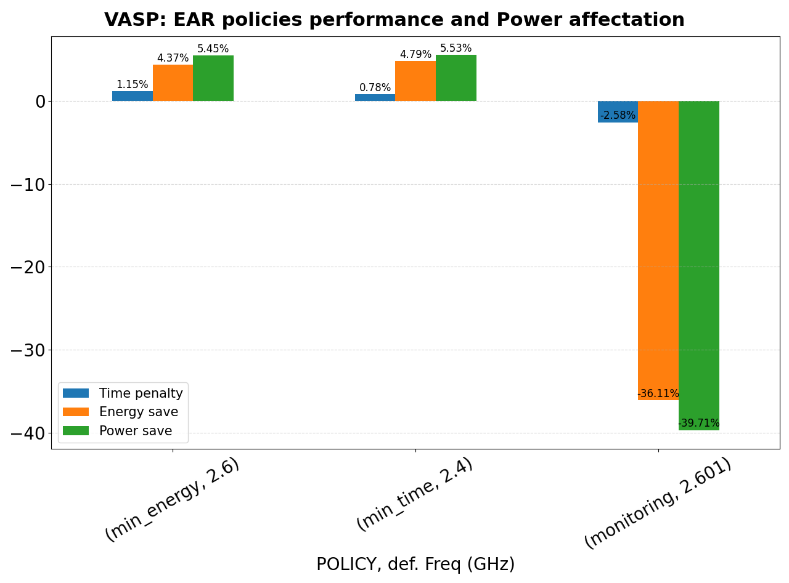

# ear-analytics

A tool to automatically read and visualize data provided by the [EAR](https://gitlab.bsc.es/ear_team/ear/-/wikis/home) framework.
**ear-analytics** is a cli program written in Python which lets you plot the EAR data given by some of its commands (e.g., `eacct -j %slurm_job_id% -l -c %file_name%`). It also has support for plotting runtime metrics in a timeline if the input file has been generated by some EAR's report plug-in.
For more information, read about [eacct](https://gitlab.bsc.es/ear_team/ear/-/wikis/Commands#energy-account-eacct) or [this guide](https://gitlab.bsc.es/ear_team/ear/-/wikis/User%20guide#running-jobs-with-ear) which shows you how to run jobs with EAR and how to obtain runtime data.

## Getting Started

These instructions will get you a copy of the project up and running on your local machine for development and testing purposes. See deployment for notes on how to deploy the project on a live system.
You can install the requirements directly or use the *requirements.txt* file given with the source code.

### Requirements

- Python 3.6.x
- Pandas 1.1.5
- Numpy 1.19.5
- Matplotlib 3.3.4
- Colorcet 2.0.6


### Installation

`$ git clone`

```
$ python3 -m pip install -U pip
$ python3 -m pip install -r requirements.txt
```

#### Using a virtual environment

```
$ python3 -m venv env_name
$ source env_name/bin/activate
(env_name) $ python -m pip install -U pip
(env_name) $ python -m pip install -r requirements.txt

# If you want to quit from virtual env:
(env_name) $ deactivate
```

## Usage

If you are using a [virtual environment](#using-a-virtual-environment) remember to activate it.

```
$ python3 ear_analytics.py -h
usage: ear_analytics [-h] [--version] [--save | --show] [-t TITLE] [-o OUTPUT]
                     [-j JOBID]
                     input_file {runtime,resume} ...

High level support for read and visualize information files given by EARL.

positional arguments:
  input_file           Specifies the input file(s) name(s) to read data from.

optional arguments:
  -h, --help           show this help message and exit
  --version            show program's version number and exit
  --save               Activate the flag to store resulting figures.
  --show               Show the resulting figure (default).
  -t, --title TITLE    Set the resulting figure title.
  -o, --output OUTPUT  Sets the output image name. Only valid if `--save` flag
                       is set.
  -j, --jobid JOBID    Filter the data by the Job ID.

subcommands:
  Type `ear_analytics <dummy_filename> {runtime,resume} -h` to get more info
  of each subcommand

  {runtime,resume}     The two functionalities currently supported by this
                       program.
    runtime            Generate a heatmap graph showing the behaviour of some
                       metrics monitored with EARL. The file must be outputed by
                       `eacct -r` command or by an EAR's report plugin.
    resume             Generate a resume about Energy and Power save, and Time
                       penalty of an application monitored with EARL.

```

You must provide the *input_file* name, which can be a DIRECTORY which only contains report files in CSV format generated by **eacct** command  (with per node information, *-l* option enabled) or by a report **plug-in** (the tool currently supports files generated by setting `--ear-user-db` flag at submission time or setting the SLURM_EAR_REPORT_ADD environment variable to load *csv_ts.so* plug-in). You can also specify only ONE FILE name if you have all the data in the same file.
Then you must provide which sub-command you want to invoke. There are two options: [resume](#resume) and [runtime](#runtime).

### resume

```
$ [ovidal@localhost ear-analytics]$ python3 ear_analytics.py dummy resume -h
usage: ear_analytics input_file resume [-h] [--app_name APP_NAME] base_freq

positional arguments:
  base_freq            Specify which frequency is used as base reference for
                       computing and showing savings and penalties in the
                       figure.

optional arguments:
  -h, --help           show this help message and exit
  --app_name APP_NAME  Set the application name to get resume info.

```

Generate a bar plot showing the power saving and time penalty, and thus the corresponding energy save of applying different configurartions to some application with respect to executions applying EAR's **monitoring** policy.
You then must to specify at which nominal frequency (i.e., *base_freq* argument) the application was running on those reference monitoring tests.

If your data contains multiple runs for the same configuration, the tool will first compute the average across all runs before showing the final comparisons.

Note that if your *input_file* contains resume information of multiple apps or jobs, you can use *--app\_name APP\_NAME* or *--jobid JOBID* options, which let you filter the data of your input file(s) and get results for only your desired application or slurm job.

#### Example

The file in `examples/vasp-policy-comparison/vasp-1218623-policies-resume.csv` directory contain perfomance metrics of executing VASP-Asis application on Snellius supercomputer under EAR policies. This file was obtained typing `eacct -j 1218623 -l -c vasp-1218623-policies-resume.csv`.
To see the performance and efficiency of the test, one can type:

`$ python ear_analytics.py -t "VASP: EAR policies performance and Power affectation" /examples/vasp-policy-comparison/vasp-1218623-policies-resume.csv resume 2.6`

Therefore it obtains:

<div align="center">
  
</div>

Note that on the above graph there is some configuration running the application using *monitoring* with a *base_freq* of 2.601 GHz.
This means that the test was run setting the Turbo CPU frequency for those nodes.

This is why the command requires the user to use the *base_freq* argument, because it becomes more flexible to compare configurations as now you can compare different *monitoring* tests (i.e., tests with different fixed CPU frequencies) with one reference monitoring test with CPU frequency fixed at *base_freq*. For example, you can see the performance of the previous application not applying any EAR optimisation policy but fixing default CPU frequency and compare it with a test where the application ran at Turbo, by typing:

`put python command`

`put the image vs. turbo`

and you can conclude that this appliction get no benefit (in terms of energy efficiency) by running it at Turbo frequency.

### runtime

```
$ python3 ear_analytics.py dumy runtime --help
usage: ear_analytics input_file runtime [-h] [-s STEPID] -m
                                        {cpi,gflops,avg.cpufreq,tpi,gbs,dc-node-power,dram-power,pck-power,p.mpi}
                                        [{cpi,gflops,avg.cpufreq,tpi,gbs,dc-node-power,dram-power,pck-power,p.mpi} ...]

optional arguments:
  -h, --help                            show this help message and exit
  -s, --stepid STEPID                   Sets the STEP ID of the job you are
                                        working with.
  -m, --metrics {cpi,gflops,avg.cpufreq,tpi,gbs,dc-node-power,dram-power,pck-power,p.mpi} [{cpi,gflops,avg.cpufreq,tpi,gbs,dc-node-power,dram-power,pck-power,p.mpi} ...]
                                        Specify which metrics you want to
                                        visualize.
```

Generate a heatmap-based graph for each metric specified by *--metrics* argument.
Note that the accepted metrics by your **ear-analytics** installation must be specified in the [configuration](#configuration) file.

The resulting figure (for each *--metric* specified) will be a timeline where for each node your application had used you will see a heatmap showing an intuitive visualization about the value of the metric each figure is showing. All nodes visualized share the same timeline, which makes this command useful to check the application behaviour across all of them.

#### Example

The next table shows content of extra/examples/bt\_test\_loops file, which content output information of all loops recorded by EAR during the execution of a BT kernel configure to be executed with 160 MPI processes accross 4 nodes. We will visualize the CPI, GFLOPS and the percentage of time spent in MPI blocking calls reported by EAR for each of the 4 nodes this kernel was executed.


To get the wanted results, we type:

`$ python ear_analytics.py -t "BT 4N" -o "BT_4N" extra/examples/bt_test_loops runtime -m cpi gflops p.mpi`

We get the following images:


### Configuration

**ear-analytics** works with a configuration file called *config.ini*. You can modify the template given in this repository.
By now, this configuration file only lets you specify which metrics will be accepted by **ear-analytics** and for which range of values will work each one based on the architecture you are working.
Note that all metrics you specify must be reported before by [eacct](https://gitlab.bsc.es/ear_team/ear/-/wikis/Commands#energy-account-eacct) command or by metrics plugin specified by SLURM\_EAR\_REPORT\_ADD environment variable,
and each metric name must be the same as it is reported in the header of the generated files.

For more information about why specify metrics configuration, read [runtime](#runtime) sub-command section.

## Contact

For any question and suggestion, contact with oriol.vidal@bsc.es.
