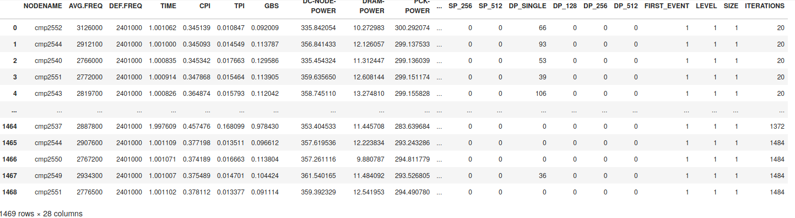
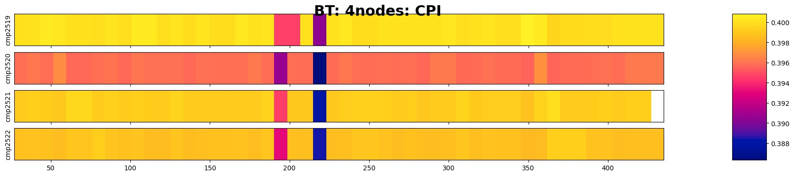
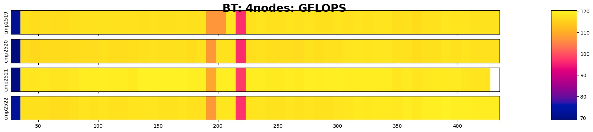
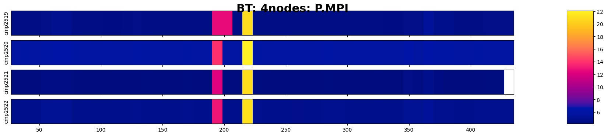

# ear-job-analytics

A tool to automatically read and visualise data provided by the [EAR](https://gitlab.bsc.es/ear_team/ear/-/wikis/home) framework.
**ear-analytics** is a cli program written in Python which lets you plot the EAR data given by some of its commands or by using some report plug-in offered by the EAR Library (EARL).
The main visualisation target is to show runtime metrics collected by EARL in a timeline graph.
By now this tool supports two kind of output formats: (I) directly generate images showing runtime information, (II) generate a trace file to be read by Paraver, a tool to visualise and manage trace data maintaned by the Barcelona Supercomputing Center's Tools team.

For more information, read about [eacct](https://gitlab.bsc.es/ear_team/ear/-/wikis/Commands#energy-account-eacct) or [this guide](https://gitlab.bsc.es/ear_team/ear/-/wikis/User%20guide#running-jobs-with-ear) which shows you how to run jobs with EAR and how to obtain runtime data.
You can find [here](https://tools.bsc.es/paraver) more information about how Paraver works.

## Features

- Generate static images showing runtime metrics of your job monitored by EARL.
    - Figures can be displayed.
- Generate Paraver traces to visualize runtime metrics within Paraver tool or any other tool of the BSC's Tools teams.
- **(New)** Generate a LaTeX project with the most relevant information about the job to be analyzed.
    - Job global summary.
    - Job phase classification.
    - Job runtime metrics.

## Requirements

- Python >= 3.6
- Pandas >= 1.5
- Numpy >= 1.19
- Matplotlib >= 3.3.4
- Colorcet >= 2
- Proplot

## Usage

It is mandatory to specify the output format (i.e., `--format`) you want produce.
Choices for this option are either *runtime*, *ear2prv* or *job-summary*, and each one enables each of the tool's features.
Read below for a detailed description of each feature.

In addition, you must specify the Job (i.e., `--job-id`) and Step (i.e., `--step-id`) IDs of the job being analyzed as features currently only support working with data corresponding with one Job-Step.
These required options ensures the tool to filter the input data by Job and Step IDs, respectively, to avoid possible errors on the output.

The *runtime* option is the one used to generate static images (which you can modify at invokation time), while *ear2prv* refers the tool interface to output data following the Paraver Trace Format.
Finally, *job-summary* generates an overview analysis of the most relevant information of the job.

By default, the tool calls internally the EAR account command (i.e., *eacct*) with the proper information and options in order to get the corresponding data to be sent to the tool's functionalities.
Be sure you have the the *eacct* command on your path, and also `EAR_ETC` environment variable is set properly.
If you have some trouble, ask your system administrator if there is some problem with the EAR Database.

If you know which *eacct* invokations are required to visualise the data, you can use the option *--input-file* to specify where the tool will find the data to be filtered by the two required job-related options (e.g., *--job-id*, *--step-id*).
This option is useful when you already have data for multiple jobs and/or steps together and you want to work on it in several ways because naturally it's more fast to work directly on a file than invoking a command to make a query to a Database, storing the output on a file, and then read such file.
This option is also useful since it lets you work on a host where you can't access EAR Database nor EAR is installed.

The way how the value of this option is handled depends on which functionality (e.g., format) you are working on, and which kind of data you want to produce/visualise.
If **runtime** format option is used, the *--input-file* option can be a single filename (which can be given with its relative path) wich contains EAR loop data.
If a directory name is given, the tool will read all files inside it (another reason why it is required to specify the Job and Step IDs).

If you start working letting the tool to use *eacct* command internally, all required files are stored temporally while the tool is doing its work.
If you want to reuse such files later you can pass the option `--keep-csv` to prevent files been removed.

### runtime

Generate a heatmap-based graph for each metric specified by `--metrics` argument (i.e., space separated list of metric names).
Note that the accepted metrics by your **ear-analytics** installation are specified in the configuration file.

The resulting figure (for each metric specified) will be a timeline where for each node your application had used you will see a heatmap showing an intuitive visualisation about the value of the metric during application execution.
All nodes visualised share the same timeline, which makes this command useful to check the application behaviour over all of them.
If your requested metric is at GPU level, timelines will be produced for each GPU used on each node involved in the application execution.

#### Examples

```
$> python ear_analytics.py --format runtime --input-file test_files/loops.gromacs_223676.csv -j 223676 -s 0 --save -l -r -m dc_power
reading file test_files/loops.gromacs_223676.csv
storing figure runtime_dc_power-223676-0
```

You can check the resulting figure [here](extra/examples/imgs/runtime_dc_power-223676-0.pdf).

### Configuration

**ear-analytics** works with a configuration file called *config.ini*. You can modify the template given in this repository.
By now, this configuration file only lets you specify which metrics will be accepted by **ear-analytics** and for which range of values will work each one based on the architecture you are working (only useful if you run the command with `--absolute-range` argument).
Note that all metrics you specify must be reported before by [eacct](https://gitlab.bsc.es/ear_team/ear/-/wikis/Commands#energy-account-eacct) command or by metrics plugin specified by SLURM\_EAR\_REPORT\_ADD environment variable,
and each metric name must be the same as it is reported in the header of the generated files.

#### Example

The next table shows content of `TODO` file, which content output information of all loops recorded by EAR during the execution of `TODO: application name` configured to be executed with `TODO` MPI processes accross `TODO` nodes. We will visualise the CPI, GFLOPS and the percentage of time spent in MPI calls reported by EAR for each node this application was executed.



To get the wanted results, we type:

`$ python ear_analytics.py -t "BT 4N" -o "BT_4N" extra/examples/bt_test_loops runtime -m cpi gflops p.mpi`

We get the following images:






## Contact

For any question and suggestion, contact with support@eas4dc.com.
You can also open an issue in this repository.
