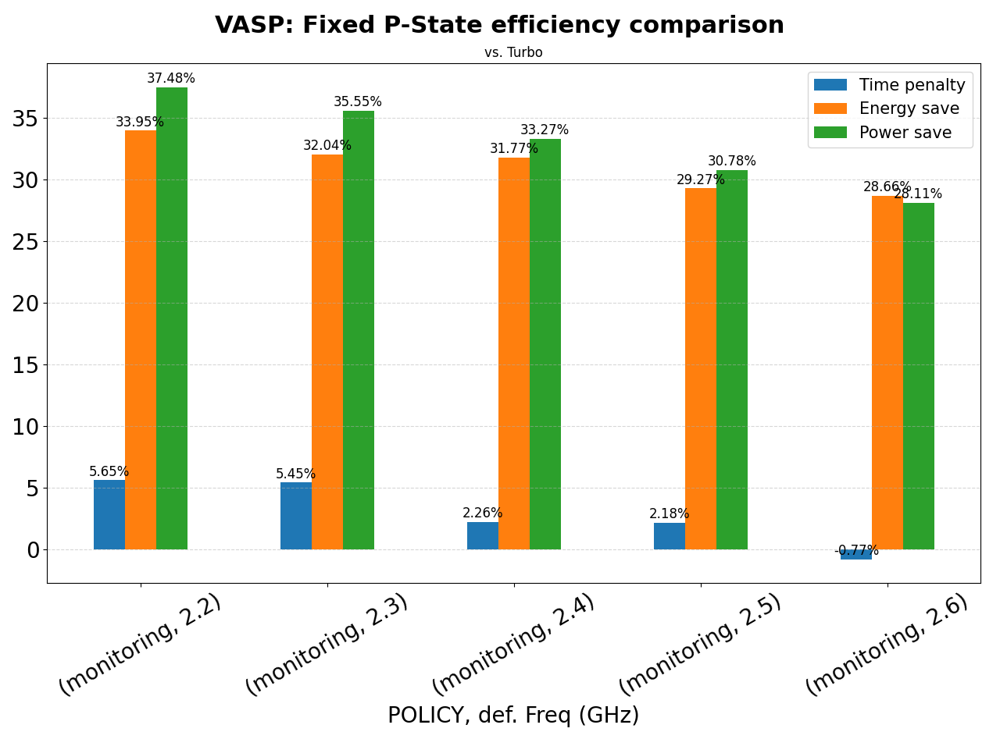

# ear-analytics

A tool to automatically read and visualise data provided by the [EAR](https://gitlab.bsc.es/ear_team/ear/-/wikis/home) framework.
**ear-analytics** is a cli program written in Python which lets you plot the EAR data given by some of its commands or by using some report plug-in offered by the EAR Library (EARL).
The visualisation target it to show runtime metrics collected by the EAR Library in a timeline graph.
By now this tool supports two kind of output formats: (I) directly generate images showing runtime information, (II) generate a trace file to be read by Paraver, a tool to visualise and manage trace data maintaned by the Barcelona Supercomputing Center's Tools team.

For more information, read about [eacct](https://gitlab.bsc.es/ear_team/ear/-/wikis/Commands#energy-account-eacct) or [this guide](https://gitlab.bsc.es/ear_team/ear/-/wikis/User%20guide#running-jobs-with-ear) which shows you how to run jobs with EAR and how to obtain runtime data. You can find [here](https://tools.bsc.es/paraver) more information about how Paraver works.

## Getting Started

These instructions will get you a copy of the project up and running on your local machine.
You can install the requirements directly or use the *requirements.txt* file given with the source code.

### Requirements

- Python 3.6.x
- Pandas 1.1.5
- Numpy 1.19.5
- Matplotlib 3.3.4
- Colorcet 2.0.6


### Installation

`$ git clone`

```
$ python -m pip install -U pip
$ python -m pip install -r requirements.txt
```

#### Using a virtual environment

```
$ python -m venv env_name
$ source env_name/bin/activate
(env_name) $ python -m pip install -U pip
(env_name) $ python -m pip install -r requirements.txt

# If you want to quit from virtual env:
(env_name) $ deactivate
```

## Usage

If you are using a [virtual environment](#using-a-virtual-environment) remember to activate it.

```
$ python ear_analytics.py -h
usage: ear_analytics [-h] [--version] --format {runtime,ear2prv}
                     [--input_file INPUT_FILE] -j JOBID -s STEPID [-n NODE]
                     [--save | --show] [-t TITLE] [-r] [-l] [-m metric] [-e]
                     [--events_config EVENTS_CONFIG] [-o OUTPUT] [-k]

High level support for read and visualise information files given by EARL.

options:
  -h, --help                     show this help message and exit
  --version                      show program's version number and exit
  --format {runtime,ear2prv}     Build results according to chosen format:
                                 runtime (static images) or ear2prv (using
                                 paraver tool).
  --input_file INPUT_FILE        Specifies the input file(s) name(s) to read
                                 data from.
  -j, --jobid JOBID              Filter the data by the Job ID.
  -s, --stepid STEPID            Filter the data by the Step ID.
  -n, --node NODE                Filter the data by the node (used ONLY for
                                 phase visualisation).
  -o, --output OUTPUT            Sets the output name. You can just set a path
                                 or a filename. For `runtime` format option,
                                 this argument is only valid if `--save` flag is
                                 given.
  -k, --keep_csv                 Don't remove temorary csv files.

`runtime` format options:
  --save                         Activate the flag to store resulting figures.
  --show                         Show the resulting figure (default).
  -t, --title TITLE              Set the resulting figure title (Only valid with
                                 runtime format).
  -r, --relative_range           Use the relative range of a metric over the
                                 trace data to build the gradient.
  -l, --horizontal_legend        Display the legend horizontally. This option is
                                 useful when your trace has a low number of
                                 nodes.
  -m, --metrics metric           Space separated list of case sensitive metrics
                                 names to visualise. Allowed values are cpi,
                                 gflops, avg.cpufreq, avg.imcfreq, tpi, gbs,
                                 dc_node_power_w, dram_power_w, pck_power_w,
                                 perc_mpi, gpower, gfreq, gutil, gmemutil,
                                 gmemfreq, io_mbs, def.freq, avg_gpu_util

`ear2prv` format options:
  -e, --events                   Include EAR events in the trace fille.
  --events_config EVENTS_CONFIG  Specify a (JSON formatted) file with event
                                 types categories. Default: events_config.json

```

It is mandatory to specify the output format (i.e., *--format*) you want produce.
The *runtime* option is the one used to generate static images (which you can modify at invokation time), while *ear2prv* refers the tool interface to output data following the Paraver Trace Format.
Moreover, you must provide the Job ID and the Step ID which you want to analyse on.

By default, the tool calls internally the EAR account command (i.e., *eacct*) with the proper information and options in order to get the corresponding data to be sent to the tool's functionalities.
Be sure you have the the *eacct* command on your path, and also `EAR_ETC` environment variable is set properly.
If you have some trouble, ask your system administrator if there is some problem with the EAR Database.

If you know which *eacct* invokations are required to visualise the data, you can use the option *--input-file* to specify where the tool will find the data to be filtered by the two required job-related options (e.g., *--job-id*, *--step-id*).
This option is useful when you already have data for multiple jobs and/or steps together and you want to work on it in several ways because naturally it's more fast to work directly on a file than invoking a command to make a query to a Database, storing the output on a file, and then read such file.
This option is also useful since it lets you work on a host where you can't access EAR Database nor EAR is installed.

The way how the value of this option is handled depends on which functionality (e.g., format) you are working on, and which kind of data you want to produce/visualise.
If **runtime** format option is used, the *--input-file* option can be a single filename (which can be given with its relative path) wich contains EAR loop data.
If a directory name is given, the tool will read all 

You must provide the *input_file* name, which can be a DIRECTORY which only contains report files in CSV format generated by **eacct** command  (with per node information, *-l* option enabled) or by a report **plug-in** (the tool currently supports files generated by setting `--ear-user-db` flag at submission time or setting the SLURM_EAR_REPORT_ADD environment variable to load *csv_ts.so* plug-in). You can also specify only ONE FILE name if you have all the data in the same file.
Then you must provide which sub-command you want to invoke. There are two options: [resume](#resume) and [runtime](#runtime).

### resume

```
$ [ovidal@localhost ear-analytics]$ python ear_analytics.py dummy resume -h
usage: ear_analytics input_file resume [-h] [--app_name APP_NAME] base_freq

positional arguments:
  base_freq            Specify which frequency is used as base reference for
                       computing and showing savings and penalties in the
                       figure.

optional arguments:
  -h, --help           show this help message and exit
  --app_name APP_NAME  Set the application name to get resume info.

```

Generate a bar plot showing the power saving and time penalty, and thus the corresponding energy save of applying different configurartions to some application with respect to executions applying EAR's **monitoring** policy.
You then must to specify at which nominal frequency (i.e., *base_freq* argument) the application was running on those reference monitoring tests.

If your data contains multiple runs for the same configuration, the tool will first compute the average across all runs before showing the final comparisons.

Note that if your *input_file* contains resume information of multiple apps or jobs, you can use *--app\_name APP\_NAME* or *--jobid JOBID* options, which let you filter the data of your input file(s) and get results for only your desired application or slurm job.

#### Example

The file in `examples/vasp-policy-comparison/vasp-1218623-policies-resume.csv` directory contain perfomance metrics of executing VASP-Asis application on Snellius supercomputer under EAR policies. This file was obtained typing `eacct -j 1218623 -l -c vasp-1218623-policies-resume.csv`.
To see the performance and efficiency of the test, one can type:

`$ python ear_analytics.py -t "VASP: EAR policies performance and Power affectation" extra/examples/vasp-policy-comparison/vasp-1218623-policies-resume.csv resume 2.6`

Therefore it obtains:

<div align="center">
  
</div>

Note that on the above graph there is some configuration running the application using *monitoring* with a *base_freq* of 2.601 GHz.
This means that the test was run setting the Turbo CPU frequency for those nodes.

This is why the command requires the user to use the *base_freq* argument, because it becomes more flexible to compare configurations as now you can compare different *monitoring* tests (i.e., tests with different fixed CPU frequencies) with one reference monitoring test with CPU frequency fixed at *base_freq*. For example, you can see the performance of the previous application not applying any EAR optimisation policy but fixing default CPU frequency and compare it with a test where the application ran at Turbo, by typing:

`$ python ear_analytics.py -t "VASP: Fixed P-State efficiency comparison" extra/examples/vasp-policy-comparison/vasp-fixed_freqs-resume.csv resume 2.601`

you get:

<div align="center">
  
</div>

and you can conclude that this appliction get no benefit (in terms of energy efficiency) by running it at Turbo frequency.

### runtime

```
$ python ear_analytics.py dummy runtime -h
usage: ear_analytics input_file runtime [-h] [-s STEPID] [-r | --absolute-range]
                                        [-l] -m metric [metric ...]

optional arguments:
  -h, --help                         show this help message and exit
  -s, --stepid STEPID                Sets the STEP ID of the job you are working
                                     with.
  -r, --relative_range               Use the relative range of a metric over the
                                     trace data to build the gradient.
  --absolute-range                   Use the absolute range configured for
                                     metrics to build the gradient (default).
  -l, --horizontal_legend            Display the legend horizontally. This
                                     option is useful when your trace has a low
                                     number of nodes.
  -m, --metrics metric [metric ...]  Space separated list of case sensitive
                                     metrics names to visualise. Allowed values
                                     are cpi, gflops, avg.cpufreq, avg.imcfreq,
                                     tpi, gbs, dc-node-power, dram-power, pck-
                                     power, p.mpi, gutil0, gmemutil0, io_mbs,
                                     def.freq
```

Generate a heatmap-based graph for each metric specified by *--metrics* argument.
Note that the accepted metrics by your **ear-analytics** installation must be specified in the [configuration](#configuration) file.

The resulting figure (for each *--metric* specified) will be a timeline where for each node your application had used you will see a heatmap showing an intuitive visualisation about the value of the metric each figure is showing.
All nodes visualised share the same timeline, which makes this command useful to check the application behaviour over all of them.

#### Configuration

**ear-analytics** works with a configuration file called *config.ini*. You can modify the template given in this repository.
By now, this configuration file only lets you specify which metrics will be accepted by **ear-analytics** and for which range of values will work each one based on the architecture you are working (only useful if you run the command with `--absolute-range` argument).
Note that all metrics you specify must be reported before by [eacct](https://gitlab.bsc.es/ear_team/ear/-/wikis/Commands#energy-account-eacct) command or by metrics plugin specified by SLURM\_EAR\_REPORT\_ADD environment variable,
and each metric name must be the same as it is reported in the header of the generated files.

#### Example

The next table shows content of `TODO` file, which content output information of all loops recorded by EAR during the execution of `TODO: application name` configured to be executed with `TODO` MPI processes accross `TODO` nodes. We will visualise the CPI, GFLOPS and the percentage of time spent in MPI calls reported by EAR for each node this application was executed.


To get the wanted results, we type:

`$ python ear_analytics.py -t "BT 4N" -o "BT_4N" extra/examples/bt_test_loops runtime -m cpi gflops p.mpi`

We get the following images:


## Contact

For any question and suggestion, contact with oriol.vidal@bsc.es.
