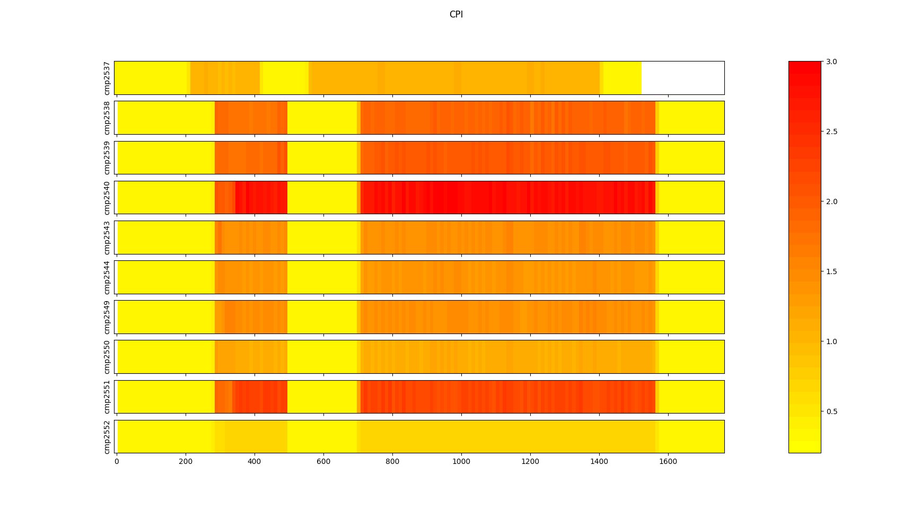

# ear-analytics

A tool to automatically read and visualize results provided by files get by 
_eacct_ command from [EAR](https://gitlab.bsc.es/ear_team/ear/-/wikis/home) framework.
**ear-analytics** is a cli program written in Python which lets you plot the data given by 
the output get when executing `eacct -j %slurm_job_id% -c %file_name%` or 
`eacct -j %slurm_job_id% -r -c %file_name%`. For more information, read about
[eacct](https://gitlab.bsc.es/ear_team/ear/-/wikis/Commands#energy-account-eacct) 
command. It also has support for plotting runtime metrics in a timeline if the input file has been generated by some EAR's report plugin.

## Getting Started

These instructions will get you a copy of the project up and running on your local machine for development and testing purposes. See deployment for notes on how to deploy the project on a live system.
You can install the requirements directly or use the *requirements.txt* file given with the source code.

### Requirements

- Python 3.6.x
- Pandas 1.1.5
- Numpy 1.19.5
- Matplotlib 3.3.4
- Colorcet 2.0.6


### Installation

`$ git clone`

```
$ python3 -m pip install -U pip
$ python3 -m pip install -r requirements.txt
```

#### Using a virtual environment

```
$ python3 -m venv env_name
$ source env_name/bin/activate
(env_name) $ python -m pip install -U pip
(env_name) $ python -m pip install -r requirements.txt

# If you want to quit from virtual env:
(env_name) $ deactivate
```

### Configuration

**ear-analytics** works with a configuration file called *config.ini*. You can modify the template given in this repository.
By now, this configuration file only lets you specify which metrics will be accepted by **ear-analytics** and for which range of values will work each one based on the architecture you are working.
Note that all metrics you specify must be reported before by [eacct](https://gitlab.bsc.es/ear_team/ear/-/wikis/Commands#energy-account-eacct) command or by metrics plugin specified by SLURM\_EAR\_REPORT\_ADD environment variable,
and each metric name must be the same as it is reported in the header of the generated files.

For more information about why specify metrics configuration, read [runtime](#runtime) sub-command section.

## Usage

If you are using a [virtual environment](#using-a-virtual-environment) remember to activate it.

```
$ python3 ear_analytics.py --help
usage: ear_analytics [-h] [--version] [--save | --show] [-t TITLE] [-o OUTPUT]
                     [-j JOBID] [-v]
                     input_file {runtime,resume} ...

High level support for read and visualize information files given by EARL.

positional arguments:
  input_file           Specifies the input file(s) name(s) to read data from.

optional arguments:
  -h, --help           show this help message and exit
  --version            show program's version number and exit
  --save               Activate the flag to store resulting figures (default).
  --show               Show the resulting figure.
  -t, --title TITLE    Set the resulting figure title.
  -o, --output OUTPUT  Sets the output image name. Only valid if `--save` flag
                       is set.
  -j, --jobid JOBID    Sets the JOB ID you are working with.
  -v, --verbosity      increase output verbosity(e.g., -vv is more than -v)

subcommands:
  Type `ear_analytics <dummy_filename> {runtime,resume} -h` to get more info
  of each subcommand

  {runtime,resume}     The two functionalities currently supported by this
                       program.
    runtime            Generate a heatmap graph showing the behaviour of some
                       metrics monitored with EARL. The file must be outputed by
                       `eacct -r` command or by an EAR's report plugin.
    resume             Generate a resume about Energy and Power save, and Time
                       penalty of an application monitored with EARL.
```

You must provide the *input_file* name, which can be a DIRECTORY which only contents report files in CSV format generated by **eacct** command  (with per node information, *-l* option enabled) or **metric plugin**. You can also specify only ONE file name if you have all the data in the same file.
Then you must provide which sub-command you want to invoke. There are two options: [resume](#resume) and [runtime](#runtime).

### resume

```
$ python3 ear_analytics.py dummy resume --help
usage: ear_analytics input_file resume [-h] [--app_name APP_NAME] [-j JOBID]
                                       base_freq

positional arguments:
  base_freq             Specify which frequency is used as base reference for
                        computing and showing savings and penalties in the
                        figure.

optional arguments:
  -h, --help            show this help message and exit
  --app_name APP_NAME   Set the application name to get resume info.
  -j JOBID, --jobid JOBID
                        Sets the JOB ID you are working with.
```

Generate a bar plot that shows Energy and Power savings, and Time penalty of applying different policies to some application with respect to executions applying EAR's MONITORING policy.
You then must to specify at which nominal frequency *base_freq* the application was running on those reference MONITORING tests.

Note that if your *input_file* contains resume information of multiple apps or jobs, you can pass to this sub-command the option *--app\_name APP\_NAME* or *--jobid JOBID*,
which will let you filter the data of your input file(s) and get results for only your desired application or slurm job.

#### Example

Files included in `examples/bqcd/` directory content output information of a job named `bqcd_4n`.

We can type:

`$ python3 ear_analytics.py -t "hello world" examples/bqcd resume 2.4`

Therefore we obtain:


### runtime

```
$ python3 ear_analytics.py dumy runtime --help

usage: ear_analytics input_file recursive [-h] -m
                                          {cpi,avg.freq,tpi,gbs,dc-node-power,dram-power,pck-power}

optional arguments:
  -h, --help            show this help message and exit
  -m {cpi,avg.freq,tpi,gbs,dc-node-power,dram-power,pck-power}, --metrics {cpi,avg.freq,tpi,gbs,dc-node-power,dram-power,pck-power}
                        Specify which metrics you want to visualize.

```

Generate a heatmap-based graph for each metric specified by *--metrics* argument.
Note that the accepted metrics by your **ear-analytics** installation must be specified in the [configuration](#configuration) file.

The resulting figure (for each *--metric* specified) will be a timeline where for each node your application had used you will see a heatmap showing an intuitive visualization about the value of the metric each figure is showing. All nodes visualized share the same timeline, which makes this command useful to check the application behaviour across all of them.

#### Example

The next table shows content of examples/pop_loops.csv file, which content output information of all loops recorded by EAR during the execution of POP application. We will visualize the CPI and GBS metrics reported by EAR for each of the 10 nodes this application was executed.


To get the wanted results, we type:

`$ python3 ear_analytics.py examples/pop_loops.csv recursive --metrics cpi --metrics gbs`

We get the following images:




## Contact

For any question and suggestion, contact with oriol.vidal@bsc.es.
