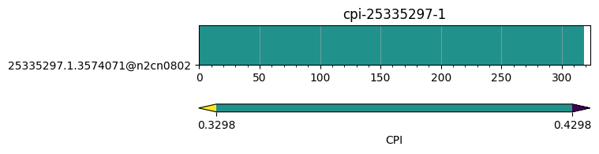

This directory contains some csv files which may be used for testing the tool. They are obtained from the EAR version which matches the ear-job-visualize version.
Filenames contain usefult information about the data, such as how much nodes and the job id and the step id of the application to specify the proper flags when using the tool, e.g.,:

```bash
ear-job-visualizer --format ear2prv -j 25335297 -s 1 --apps-file examples/csvs/dgemm_1n_app_signature_j25335297_s1.csv --loops-file examples/csvs/dgemm_1n_loop_signatures_j25335297_s1.csv 
```
The output would look like:
```
Using /gpfs/gpfs_de6000/home/xovidal/apps/ear-job-visualization/src/ear_job_visualize/config.json as configuration file...
Number of nodes: 1. Total trace duration: 323000000
Number of applications (job-step): 1
```

Generated files are located in [traces](./traces) directory.

Generating an image showing the CPI along the execution time:

```bash
ear-job-visualizer --format runtime --apps-file dgemm_1n_app_signature_j25335297_s1.csv --loops-file dgemm_1n_loop_signatures_j25335297_s1.csv -j 25335297 -s 1 -m cpi
```

The output would look like:
```
Using /gpfs/gpfs_de6000/home/xovidal/apps/ear-job-visualization/src/ear_job_visualize/config.json as configuration file...
Creating the figure...
Setting title: cpi-25335297-1
Warning! 2 discrete intervals generated.
Consider decreasing the step (currently 0.1)
storing figure runtime_cpi
```

The generated image is:
.
